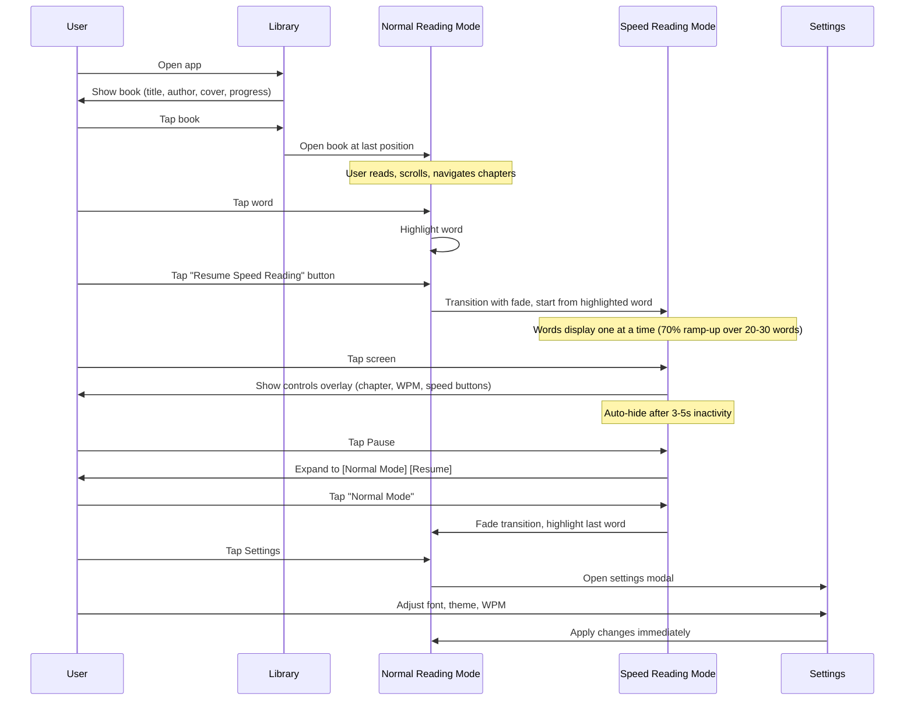

# Core Flows: Speed Reading PWA

## Overview

This document defines the complete user flows for the Speed Reading PWA, covering the dual-mode reading experience (Speed Reading Mode and Normal Reading Mode), transitions between modes, settings management, and progress tracking.

## Flow Diagram

---

## Flow 1: App Launch & Library View

**Description:** User opens the app and sees their book library.

**Trigger:** User navigates to the app URL or taps the installed PWA icon.

**Steps:**

1. App loads and displays the Library view
2. Library shows the hardcoded book with:
   - Book title: "La Sangre de los Elfos"
   - Author name: "Andrzej Sapkowski"
   - Cover image (if available from EPUB metadata)
   - Reading progress percentage (e.g., "42% complete")
3. User taps the book card
4. App opens the book in Normal Reading Mode at the last saved reading position

**Exit:** User is now in Normal Reading Mode (Flow 2)

---

## Flow 2: Normal Reading Mode

**Description:** User reads the book in traditional scrollable format with full context.

**Trigger:** 
- Opening a book from the library
- Transitioning from Speed Reading Mode via Pause → Normal Mode
- Reaching the end of the book in Speed Reading Mode

**Steps:**

1. **Initial Display:**
   - Screen shows scrollable text content
   - Header displays:
     - Back button (left)
     - Current chapter name (center)
     - Progress percentage (e.g., "Chapter 3 • 42%")
     - Settings icon (right)
   - Text is rendered using chunked loading pattern (50 paragraphs per chunk)
   - Scroll position is at the last saved reading position
   - If transitioning from Speed Reading Mode, the last word seen is highlighted

2. **Reading & Navigation:**
   - User scrolls vertically through text
   - Chunked loading: Load visible chunks + 2-chunk padding on each side
   - Dynamic pruning: Remove chunks outside visible window
   - Debounced save: Reading position auto-saves after 1 second of scroll stability

3. **Chapter Navigation:**
   - User taps chapter name in header
   - Chapter menu slides down showing list of all chapters
   - User selects a chapter
   - View scrolls to the selected chapter's start position
   - Chapter menu closes

4. **Word Selection for Speed Reading:**
   - User taps any word in the text
   - Word becomes highlighted (persistent highlight)
   - Tapping the same word again deselects it
   - Tapping a different word moves the highlight
   - Fixed floating button appears in bottom-right corner: "Resume Speed Reading"

5. **Settings Access:**
   - User taps Settings icon in header
   - Full-screen settings modal overlays the reading view
   - Settings include:
     - Font size slider
     - Font family dropdown (serif, sans-serif, monospace)
     - Theme toggle (light/dark mode)
     - WPM slider for Speed Reading Mode (100-600, default 250)
   - All changes apply immediately (live preview)
   - User taps outside modal or close button to dismiss

6. **Transition to Speed Reading:**
   - User taps "Resume Speed Reading" button (bottom-right)
   - If a word is highlighted: Speed Reading starts from that word
   - If no word is highlighted: Speed Reading starts from first visible paragraph
   - Transition: Fade to black, then fade into Speed Reading Mode
   - Highlight clears when Speed Reading Mode activates

7. **Back to Library:**
   - User taps Back button in header
   - Reading position is saved
   - App returns to Library view

**Exit:** User transitions to Speed Reading Mode (Flow 3) or returns to Library (Flow 1)

---

## Flow 3: Speed Reading Mode

**Description:** User reads one word at a time at a controlled pace (RSVP - Rapid Serial Visual Presentation).

**Trigger:**
- User taps "Resume Speed Reading" button in Normal Reading Mode
- User taps "Resume" after pausing in Speed Reading Mode

**Steps:**

1. **Entry & Ramp-Up:**
   - Transition: Fade from Normal Reading Mode (or previous pause state)
   - Screen displays one word at a time, centered
   - Speed ramp-up: Start at 70% of target WPM, linearly increase to 100% over 20-30 words
   - Screen is minimal: just the current word, no distractions
   - Words advance automatically based on WPM setting

2. **Showing Controls:**
   - User taps anywhere on screen
   - Controls overlay fades in:
     - **Top header:** Current chapter name (left), WPM display (right)
     - **Bottom controls:** [Slow Down] [Pause] [Speed Up]
     - **Back button** (top-left corner)
   - Word display continues in the background
   - Controls auto-hide after 3-5 seconds of inactivity

3. **Speed Adjustment:**
   - User taps "Speed Up" button
     - WPM increases by 10% of current speed
     - Result is rounded to nearest 5 WPM (e.g., 250 → 275, not 275.5)
     - WPM display in header updates immediately
     - Word display speed increases (user feels the change)
     - Button shows press animation
   - User taps "Slow Down" button
     - WPM decreases by 10% of current speed
     - Result is rounded to nearest 5 WPM
     - WPM display updates immediately
     - Word display speed decreases
     - Button shows press animation
   - Controls remain visible, reset auto-hide timer

4. **Pausing:**
   - User taps "Pause" button
   - Word display stops on current word
   - Pause button expands into two buttons:
     - **[Normal Mode]** - Transition to Normal Reading Mode
     - **[Resume]** - Continue Speed Reading from current word
   - Controls remain visible (no auto-hide while paused)

5. **Resume from Pause:**
   - User taps "Resume" button
   - Pause buttons collapse back to single Pause button
   - Word display resumes from current word
   - Speed ramp-up: Start at 70% of target WPM, reach 100% over 20-30 words
   - Controls auto-hide after 3-5 seconds

6. **Transition to Normal Mode:**
   - User taps "Normal Mode" button (while paused)
   - Transition: Fade to black, then fade into Normal Reading Mode
   - Normal Reading Mode displays text centered on current position
   - Last word seen in Speed Reading Mode is highlighted (persistent)
   - "Resume Speed Reading" button is visible in bottom-right

7. **Reaching End of Book:**
   - Speed Reading displays the last word
   - After displaying the last word, automatic transition to Normal Reading Mode
   - Normal Reading Mode shows the final paragraphs
   - User can scroll back or return to library

8. **Back to Library:**
   - User taps screen to show controls
   - User taps Back button
   - Reading position is saved
   - App returns to Library view

**Exit:** User transitions to Normal Reading Mode (Flow 2) or returns to Library (Flow 1)

---

## Flow 4: Settings Management

**Description:** User customizes reading experience (fonts, themes, WPM).

**Trigger:** User taps Settings icon in Normal Reading Mode header.

**Steps:**

1. Settings modal overlays the reading view (full-screen)
2. Modal displays:
   - **Font Size:** Slider (small → medium → large → extra large)
   - **Font Family:** Dropdown (Serif, Sans-serif, Monospace)
   - **Theme:** Toggle (Light / Dark mode)
   - **Speed Reading WPM:** Slider (100-600, shows current value)
3. User adjusts any setting:
   - Changes apply immediately to the reading view behind the modal
   - Live preview allows user to see changes in real-time
4. User taps outside modal or close button to dismiss
5. Settings are persisted to localStorage
6. User returns to Normal Reading Mode with new settings applied

**Exit:** User returns to Normal Reading Mode (Flow 2)

---

## Flow 5: Progress Persistence

**Description:** App automatically saves and restores reading position.

**Trigger:** User scrolls in Normal Reading Mode or advances words in Speed Reading Mode.

**Steps:**

1. **Auto-Save in Normal Reading Mode:**
   - User scrolls through text
   - After 1 second of scroll stability (debounced)
   - App saves the first visible paragraph ID to localStorage
   - Optional (recommended with virtualization + variable paragraph heights): also save the virtualized scroll offset (px) so restoration is exact
   - Save includes: bookId, paragraphId, wordIndex (if applicable)

2. **Auto-Save in Speed Reading Mode:**
   - As words advance, current word position is tracked
   - Position is saved periodically (every 10-20 words or on pause)
   - Save includes: bookId, paragraphId, wordIndex

3. **Restore on App Launch:**
   - User opens book from library
   - App reads saved position from localStorage
   - Normal Reading Mode scrolls to saved paragraph (and/or restores saved scroll offset)
   - If user was in Speed Reading Mode, position is ready for resume

4. **Cross-Session Persistence:**
   - User closes app/browser
   - User returns later
   - Library shows updated progress percentage
   - Opening book resumes from exact position

**Exit:** Continuous background process, no explicit exit

---

## Flow 6: Word Highlighting & Selection

**Description:** User selects a specific word to resume Speed Reading from that position.

**Trigger:** User taps a word in Normal Reading Mode.

**Steps:**

1. User taps any word in the text
2. Word receives persistent highlight (e.g., yellow background)
3. "Resume Speed Reading" button is visible in bottom-right corner
4. User can:
   - **Tap same word again:** Deselect (highlight clears)
   - **Tap different word:** Move highlight to new word
   - **Scroll away:** Highlight persists (scrolls with text)
   - **Tap "Resume Speed Reading":** Start Speed Reading from highlighted word
5. When Speed Reading starts:
   - Highlight clears automatically
   - Speed Reading begins at the selected word
   - Ramp-up applies (70% → 100% over 20-30 words)
6. When returning to Normal Mode from Speed Reading:
   - Last word seen in Speed Reading is highlighted
   - Highlight persists until user selects a different word or scrolls

**Exit:** Highlight clears when Speed Reading starts or user deselects

---

## Flow 7: Chapter Navigation

**Description:** User jumps to a specific chapter in Normal Reading Mode.

**Trigger:** User taps chapter name in Normal Reading Mode header.

**Steps:**

1. User taps current chapter name in header (center)
2. Chapter menu slides down from header
3. Menu displays scrollable list of all chapters:
   - Chapter number (if available)
   - Chapter title
   - Current chapter is highlighted/marked
4. User scrolls through chapter list (if many chapters)
5. User taps a chapter
6. Chapter menu slides up (closes)
7. Reading view smoothly scrolls to the start of selected chapter
8. Header updates to show new chapter name
9. Progress percentage updates

**Exit:** User returns to reading in Normal Reading Mode (Flow 2)

---

## Interaction Patterns Summary

### Speed Reading Mode Controls
- **Tap screen:** Show/hide controls overlay
- **Controls auto-hide:** After 3-5 seconds of inactivity
- **Speed Up/Down:** Adjust WPM by ±10%, rounded to nearest 5
- **Pause:** Expands to [Normal Mode] [Resume]
- **Back button:** Return to library

### Normal Reading Mode Controls
- **Header:** Back, Chapter menu, Settings, Progress
- **Tap word:** Highlight for Speed Reading resume point
- **Resume Speed Reading button:** Fixed bottom-right, always visible
- **Scroll:** Chunked loading with auto-save

### Transitions
- **Speed → Normal:** Fade to black → Fade in, highlight last word
- **Normal → Speed:** Fade to black → Fade in, start from highlighted word
- **Ramp-up:** 70% → 100% over 20-30 words (linear)

### Persistence
- Reading position (paragraph + word index)
- Settings (font, theme, WPM)
- Last reading mode (Speed or Normal)
- Word highlights (cleared on mode switch)

---

## Edge Cases & Error Handling

### Empty or Invalid Content
- If EPUB parsing fails: Show error message in library
- If no chapters detected: Show "Full book" as single chapter
- If book has no content: Disable opening the book

### End of Book
- Speed Reading Mode: Auto-transition to Normal Mode at last word
- Normal Reading Mode: Show "End of book" indicator, allow scrolling back

### Settings Boundaries
- WPM: Clamp to 100-600 range
- Font size: Clamp to predefined sizes (small, medium, large, XL)
- Invalid localStorage data: Reset to defaults

### Scroll Performance
- Large books: Chunked loading prevents memory issues
- Rapid scrolling: Debounced saves prevent excessive writes
- Missing chunks: Show placeholder paragraphs until loaded

### Highlight Persistence
- Highlight clears when entering Speed Reading Mode
- Highlight persists across scrolling in Normal Mode
- Highlight clears when user selects different word
- Last word from Speed Reading is highlighted when returning to Normal Mode

---

## Technical Notes

### EPUB Parsing
- Use petra_reader's approach: Backend processes EPUB into paragraph chunks
- For this MVP: Pre-process the hardcoded EPUB file
- Paragraphs stored with sequential IDs for position tracking

### Scroll Performance
- Chunk size: 50 paragraphs
- Window padding: 2 chunks on each side of visible area
- Virtualization: Use `@tanstack/react-virtual`
- Placeholder strategy: Pre-allocate array, overlay loaded chunks

### State Management
- Reading position: localStorage (bookId → {paragraphId, wordIndex, mode})
- Settings: localStorage (global settings object)
- Current mode: React state (Speed/Normal)
- Highlighted word: React state (paragraphId, wordIndex)

### Word Extraction
- Parse paragraphs into word arrays
- Track word positions: {paragraphId, wordIndex}
- Handle punctuation: Keep with words (e.g., "dragon," not "dragon" + ",")
- Handle line breaks: Treat as word boundaries

### WPM Calculation
- WPM = Words Per Minute
- Delay between words = 60,000ms / WPM
- Example: 250 WPM → 240ms per word
- Ramp-up: Interpolate delay from 70% to 100% over N words
