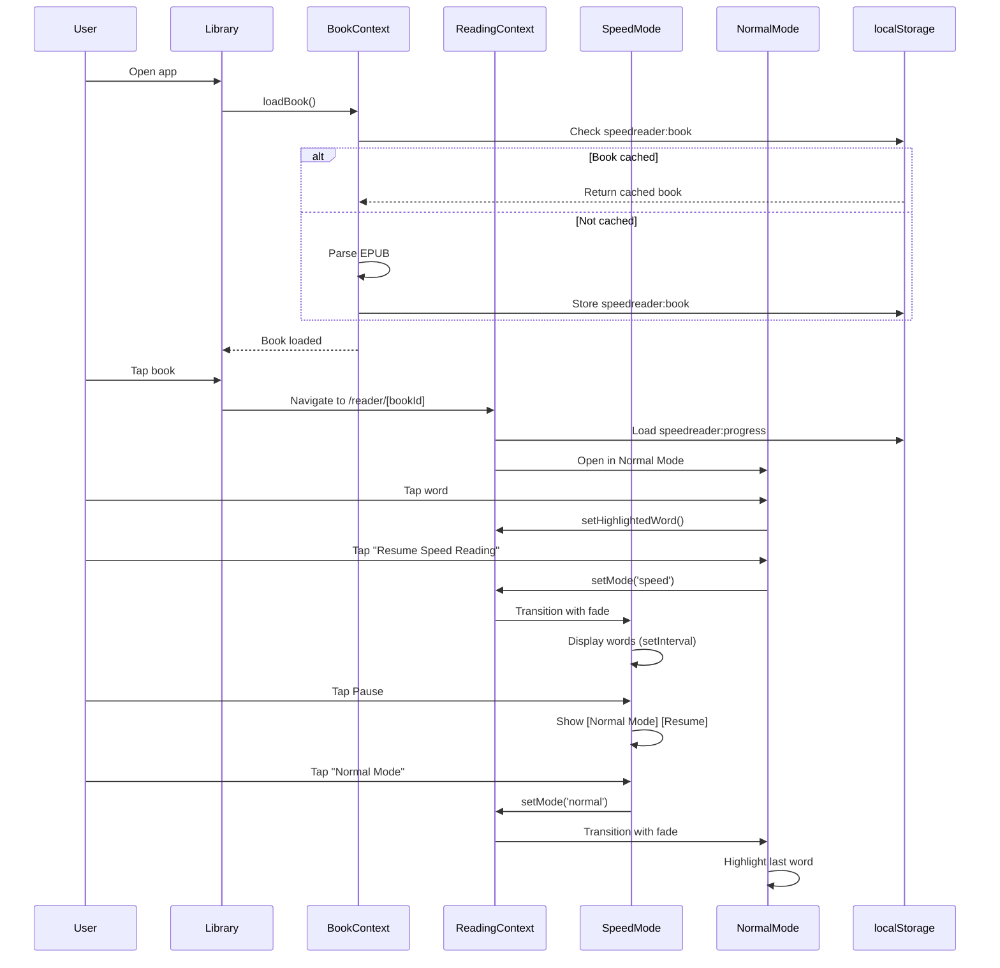

# Tech Plan: Speed Reading PWA

## Architectural Approach

### 1. Client-Side Architecture

**Decision:** Fully static application with build-time EPUB processing.

**Rationale:**

- Simplest deployment (static site export, any host)
- Zero infrastructure costs (no server, no serverless functions)
- Fastest first load (no runtime EPUB parsing)
- Perfect for MVP with single hardcoded book
- Future-ready for backend integration when adding user uploads

**Implementation:**

- Next.js with static export (`output: 'export'`)
- EPUB processing at build time (Node.js script)
- Pre-processed book data generated as a static JSON file (avoid bundling 2-5MB into the JS bundle)
- localStorage for progress/settings persistence only
- Dynamic routes must be pre-generated for static export (use `generateStaticParams` + `dynamicParams = false`); MVP has a single known `bookId`
- Service worker registered in client component

**Next.js Configuration:**

```typescript
// next.config.ts
const nextConfig = {
  output: 'export',
  // If using next/image, default optimization is not supported with static export.
  // Prefer  for MVP or configure a custom image loader:
  // images: { loader: 'custom', loaderFile: './image-loader.ts' },
};
```

**Trade-offs:**

- ✅ Simplest deployment (fully static)
- ✅ Fastest first load (no parsing)
- ✅ No server costs
- ✅ Works on any static host (Vercel, Netlify, GitHub Pages, etc.)
- ❌ Larger static asset (~2-5MB JSON) and storage footprint (cache it; avoid inflating the JS bundle)
- ❌ Requires rebuild to change book
- ⚠️ Future user uploads need different approach

---

### 2. EPUB Processing Strategy

**Decision:** Pre-process EPUB at build time, bundle parsed JSON data (fully static).

**Rationale:**

- Simplest deployment (no runtime parsing, no serverless functions)
- Fastest first load (no EPUB processing delay)
- Avoids Node.js/browser compatibility issues with petra_reader's parser
- Perfect for MVP with single hardcoded book
- Reuses petra_reader's proven parsing logic at build time

**Implementation:**

```typescript
// Build-time processing (Node.js script):
1. Read EPUB file from project root
2. Use petra_reader's epub.ts parser (Node.js environment)
3. Extract paragraphs with sequential IDs
4. Extract chapters with TOC matching
5. Write JSON to public/books/<bookId>.json (static asset)
6. Build exports the static assets

// Runtime (browser):
1. Fetch pre-processed book data from /books/<bookId>.json
2. Cache in localStorage: speedreader:book:<bookId> (for progress tracking + offline-ish behavior)
3. No parsing needed - instant load after first fetch
```

**Build Script:**

```bash
# scripts/process-epub.ts
- Runs via package.json prebuild hook (recommended)
- Uses petra_reader's epub parsing logic
- Outputs JSON to public/books/<bookId>.json
- Validates output structure
```

**Trade-offs:**

- ✅ Simplest deployment (fully static, any host)
- ✅ Fastest first load (no parsing)
- ✅ No browser compatibility issues
- ✅ Smaller runtime bundle (no epub2/cheerio)
- ❌ Larger static asset (~2-5MB JSON)
- ❌ Requires rebuild to change book
- ⚠️ Future user uploads will need different approach (serverless or client-side parser)

---

### 3. Word Extraction Strategy

**Decision:** Unified chunk system - use paragraph chunks, parse words on-demand from paragraph text.

**Rationale:**

- Simplest architecture (single chunking system for both modes)
- Reuses petra_reader's proven paragraph chunking (50 paragraphs/chunk)
- Avoids dual chunk management complexity
- Parse words from paragraph text as needed in Speed Reading Mode
- Memory-efficient (no separate word chunk cache)

**Implementation:**

```typescript
// Reuse paragraph chunks from Normal Reading Mode
type ParagraphChunk = {
  chunkIndex: number;
  paragraphs: Array<{
    id: number;
    text: string;
  }>;
};

// Word extraction (on-demand in Speed Reading Mode):
function extractWordsFromParagraph(paragraphText: string): string[] {
  // Smart tokenization:
  // 1. Split on whitespace: /\s+/
  // 2. Handle contractions as single words (don't, can't)
  // 3. Handle hyphens as single words (well-known)
  // 4. Strip surrounding quotes but keep internal punctuation
  return paragraphText
    .split(/\s+/)
    .map(word => word.replace(/^["']+|["']+$/g, '')) // Strip quotes
    .filter(word => word.length > 0);
}

// Speed Reading Mode:
- Get current paragraph from paragraph chunks
- Extract words on-demand using extractWordsFromParagraph()
- Cache current paragraph's words in component state
- When reaching end of paragraph, load next paragraph and extract words
- Auto-advance seamlessly through paragraphs and chapters
```

**Word Boundary Rules:**

- **Contractions:** Keep as single word ("don't" not "don" + "t")
- **Hyphens:** Keep as single word ("well-known" not "well" + "known")
- **Quotes:** Strip surrounding quotes ("word" → word, 'word' → word)
- **Punctuation:** Keep internal punctuation ("word's" stays as "word's")
- **Spanish punctuation:** Handle ¿¡ naturally (part of sentence, not separate words)

**Trade-offs:**

- ✅ Simplest architecture (single chunk system)
- ✅ Reuses petra_reader's proven patterns
- ✅ Memory-efficient (no separate word cache)
- ✅ Easy to maintain and debug
- ⚠️ Parse words on paragraph transition (minimal overhead)
- ⚠️ User accepts potential DOM management issues (will optimize if needed)

---

### 4. Routing & Navigation

**Decision:** Next.js App Router with URL-based navigation.

**Rationale:**

- Matches petra_reader's architecture (file:../petra_reader/src/app)
- Future-proof for backend integration
- Browser back button support
- Deep linking capabilities

**Routes:**

```
/                          → Library view (hardcoded book)
/reader/[bookId]           → Reading view (Normal/Speed modes)
/reader/[bookId]/settings  → Settings modal (optional route)
```

**State Management:**

- URL params: bookId
- React Context: reading mode, position, settings
- localStorage: persistence layer

**Static Export Constraint (Important):**

With `output: 'export'`, dynamic routes like `/reader/[bookId]` must be pre-generated at build time:

```typescript
// app/reader/[bookId]/page.tsx
export const dynamicParams = false;

export async function generateStaticParams() {
  // MVP: single known book
  return [{ bookId: 'la-sangre-de-los-elfos' }];
}
```

**Trade-offs:**

- ✅ Scalable for multi-book library
- ✅ Browser navigation works naturally
- ❌ Slightly more complex than single-page state management

---

### 5. Word Highlighting Performance

**Decision:** Use `document.caretRangeFromPoint()` for dynamic word extraction (petra_reader pattern).

**Rationale:**

- Avoids wrapping every word in a `<span>` (thousands of DOM nodes)
- Dramatically improves rendering performance
- Proven solution from petra_reader (file:../petra_reader/src/components/language-reader.tsx lines 709-784)

**Implementation:**

```typescript
// On paragraph click:
1. Get click coordinates (clientX, clientY)
2. Use document.caretRangeFromPoint() to find text node + offset
3. Walk backwards/forwards to find word boundaries
4. Extract word + sentence context
5. Highlight word position (store paragraphId + wordIndex)
6. Render highlight overlay at calculated position
```

**Trade-offs:**

- ✅ Excellent performance (no per-word DOM nodes)
- ✅ Natural text selection behavior
- ❌ More complex implementation than span wrapping
- ❌ Requires careful handling of text node boundaries

---

### 6. Dual-Mode Architecture

**Decision:** Two distinct reading modes sharing the same data layer.

**Rationale:**

- Clear separation of concerns
- Each mode optimized for its use case
- Smooth transitions via shared state

**Mode Switching:**

```typescript
// Shared state (React Context):
{
  currentPosition: { paragraphId: number, wordIndex: number },
  mode: 'speed' | 'normal',
  settings: { wpm, fontSize, theme }
}

// Transition flow:
Speed → Normal: Fade out → Update mode → Fade in → Highlight last word
Normal → Speed: Fade out → Update mode → Fade in → Start from highlighted word
```

**Trade-offs:**

- ✅ Clean architecture, easy to maintain
- ✅ Each mode can be optimized independently
- ❌ Requires careful state synchronization

---

### 7. Styling & Animations

**Decision:** Tailwind CSS + CSS transitions.

**Rationale:**

- Matches petra_reader's styling approach
- Utility-first for rapid development
- CSS transitions are performant and simple

**Implementation:**

- Tailwind CSS v4 (latest)
- CSS transitions for fade effects
- Mobile-first responsive design
- Dark/light theme support via Tailwind's dark mode (system by default; class-based toggle for user control)

**Tailwind v4 Setup (App Router):**

```js
// postcss.config.mjs
export default {
  plugins: {
    '@tailwindcss/postcss': {},
  },
};
```

```css
/* app/globals.css */
@import "tailwindcss";

/* Optional: class-based dark mode toggle */
@custom-variant dark (&:where(.dark, .dark *));
```

**Trade-offs:**

- ✅ Consistent with petra_reader
- ✅ Fast development, small bundle
- ❌ Requires learning Tailwind conventions

---

### 8. PWA Configuration

**Decision:** Basic PWA setup (manifest + minimal service worker).

**Rationale:**

- Follows petra_reader's PWA pattern (service worker + offline fallback) and uses Next.js `app/manifest.ts` for the manifest
- Installable to home screen
- Offline fallback page
- No aggressive caching (requires connection for data)

**Implementation:**

```javascript
// app/manifest.ts (Next.js App Router)
// Export a Web App Manifest via MetadataRoute.Manifest

// sw.js (minimal service worker)
- Cache offline.html fallback page
- Serve offline page when network fails
- No app shell caching (keep it simple)
```

**Service Worker Registration (Client Component):**

```typescript
// Register /sw.js from a 'use client' component (e.g., in layout)
useEffect(() => {
  if ('serviceWorker' in navigator) {
    navigator.serviceWorker.register('/sw.js', {
      scope: '/',
      updateViaCache: 'none',
    });
  }
}, []);
```

**Static Export Note:** Next.js cannot set runtime headers in static export. If you need `Content-Type` and `Cache-Control` for `/sw.js`, configure them in your static host/CDN settings.

**Trade-offs:**

- ✅ Installable, feels like native app
- ✅ Simple, no complex caching logic
- ❌ Requires connection for full functionality

---

### 9. Timing & Animation

**Decision:** `setTimeout` chain with pre-calculated delays for ramp-up.

**Rationale:**

- Simple and clear for AI to understand
- Precise timing control (can vary delay per word)
- Perfect for ramp-up implementation
- No interval recreation overhead

**Implementation:**

```typescript
// Speed Reading timing
function calculateDelay(wpm: number): number {
  return Math.round(60000 / wpm); // e.g., 250 WPM → 240ms per word
}

// Pre-calculate ramp-up delays
function calculateRampUpDelays(targetWpm: number, rampUpWords: number = 25): number[] {
  const startWpm = targetWpm * 0.7;
  const wpmIncrement = (targetWpm - startWpm) / rampUpWords;
  
  const delays: number[] = [];
  for (let i = 0; i < rampUpWords; i++) {
    const currentWpm = startWpm + (wpmIncrement * i);
    delays.push(calculateDelay(currentWpm));
  }
  return delays;
}

// setTimeout chain for word display
let timeoutId: NodeJS.Timeout | null = null;
let wordIndex = 0;
let isRampingUp = true;
const rampUpDelays = calculateRampUpDelays(targetWpm);
const steadyDelay = calculateDelay(targetWpm);

function displayNextWord() {
  if (wordIndex >= totalWords) {
    // End of book - transition to Normal Mode
    return;
  }
  
  const currentWord = words[wordIndex];
  setDisplayedWord(currentWord);
  wordIndex++;
  
  // Calculate delay for next word
  const delay = isRampingUp && wordIndex < rampUpDelays.length
    ? rampUpDelays[wordIndex]
    : steadyDelay;
  
  if (wordIndex >= rampUpDelays.length) {
    isRampingUp = false;
  }
  
  // Schedule next word
  timeoutId = setTimeout(displayNextWord, delay);
}

// Start reading
displayNextWord();

// Pause: clearTimeout(timeoutId)
// Resume: reset rampUp, call displayNextWord()
```

**Ramp-up Behavior:**

- Start at 70% of target WPM
- Linear increase to 100% over 25 words (20-30 range)
- Pre-calculated delays for predictable performance
- On resume from pause: restart ramp-up from 70%

**Trade-offs:**

- ✅ Simple, clear, easy to understand
- ✅ Precise timing control
- ✅ Efficient (no interval recreation)
- ✅ Easy to pause/resume
- ❌ Slightly more code than setInterval
- ❌ Can drift slightly on slow devices (same as setInterval)

---

## Data Model

### 1. localStorage Schema

**Structure:** Separate keys for each concern.

```typescript
// speedreader:book
{
  id: string;
  title: string;
  author: string;
  coverUrl?: string;
  paragraphs: Array<{
    id: number;
    text: string;
  }>;
  chapters: Array<{
    index: number;
    title: string;
    startParagraphId: number;
  }>;
  totalWords: number;
  processedAt: number; // timestamp
}

// speedreader:progress
{
  bookId: string;
  paragraphId: number;
  wordIndex: number;
  mode: 'speed' | 'normal';
  lastReadAt: number; // timestamp
  percentComplete: number;
}

// speedreader:settings
{
  wpm: number; // 100-600, default 250
  fontSize: 'small' | 'medium' | 'large' | 'xl';
  fontFamily: 'serif' | 'sans-serif' | 'monospace';
  theme: 'light' | 'dark';
}
```

**Size Estimates:**

- Book data: ~2-5MB (typical novel)
- Progress: <1KB
- Settings: <1KB
- Total: ~2-5MB (well within 10MB localStorage limit)

**Error Handling:**

- No special handling for localStorage quota limits (assume it won't happen for MVP)
- Future: Add try-catch and fallback to in-memory storage if needed

---

### 2. In-Memory State (React Context)

```typescript
// BookContext
type BookContextValue = {
  book: Book | null;
  isLoading: boolean;
  error: string | null;
  loadBook: () => Promise<void>;
};

// ReadingContext
type ReadingContextValue = {
  mode: 'speed' | 'normal';
  position: { paragraphId: number; wordIndex: number };
  highlightedWord: { paragraphId: number; wordIndex: number } | null;
  setMode: (mode: 'speed' | 'normal') => void;
  updatePosition: (position: Position) => void;
  setHighlightedWord: (word: Position | null) => void;
};

// SettingsContext
type SettingsContextValue = {
  settings: Settings;
  updateSettings: (partial: Partial<Settings>) => void;
};
```

---

### 3. Word Chunk Cache (In-Memory)

```typescript
// WordChunkManager
class WordChunkManager {
  private chunks: Map<number, WordChunk> = new Map();
  private readonly CHUNK_SIZE = 500; // words per chunk
  private readonly MAX_CACHED_CHUNKS = 3;

  parseChunk(chunkIndex: number): WordChunk {
    // Parse paragraphs into words for this chunk
  }

  getWord(globalWordIndex: number): Word {
    // Calculate chunk index, fetch/parse if needed
  }

  pruneDistantChunks(currentChunkIndex: number): void {
    // Remove chunks outside window
  }
}
```

---

### 4. Position Tracking

```typescript
// Position representation
type Position = {
  paragraphId: number;  // Sequential ID from EPUB parsing
  wordIndex: number;    // Index within paragraph (0-based)
};
  
// Position tracking behavior:
// - Speed Reading Mode: Auto-advance through paragraphs and chapters seamlessly (no pauses)
// - Normal Reading Mode: Highlight stays at original word location when user scrolls away
// - Highlight persists until user taps a different word or enters Speed Reading Mode
// - When entering Speed Reading from Normal Mode: start from highlighted word (if any)

// Global word index calculation
function toGlobalWordIndex(position: Position, book: Book): number {
  let globalIndex = 0;
  for (const para of book.paragraphs) {
    if (para.id === position.paragraphId) {
      return globalIndex + position.wordIndex;
    }
    globalIndex += para.text.split(/\s+/).length;
  }
  return globalIndex;
}

// Reverse: global index → position
function toPosition(globalIndex: number, book: Book): Position {
  let remaining = globalIndex;
  for (const para of book.paragraphs) {
    const wordCount = para.text.split(/\s+/).length;
    if (remaining < wordCount) {
      return { paragraphId: para.id, wordIndex: remaining };
    }
    remaining -= wordCount;
  }
  return { paragraphId: book.paragraphs[0].id, wordIndex: 0 };
}
```

---

## Component Architecture

### 1. App Structure (Next.js App Router)

```
src/
├── app/
│   ├── layout.tsx              # Root layout, providers
│   ├── globals.css             # Tailwind entrypoint (@import "tailwindcss")
│   ├── manifest.ts             # Web App Manifest (MetadataRoute)
│   ├── page.tsx                # Library view
│   └── reader/
│       └── [bookId]/
│           └── page.tsx        # Reading view (dual-mode)
├── components/
│   ├── library/
│   │   └── BookCard.tsx        # Book display in library
│   ├── reader/
│   │   ├── SpeedReadingMode.tsx
│   │   ├── NormalReadingMode.tsx
│   │   ├── ControlsOverlay.tsx
│   │   ├── SettingsModal.tsx
│   │   └── ChapterMenu.tsx
│   └── shared/
│       ├── FadeTransition.tsx
│       └── ProgressBar.tsx
├── contexts/
│   ├── BookContext.tsx
│   ├── ReadingContext.tsx
│   └── SettingsContext.tsx
├── lib/
│   ├── storage/
│   │   └── localStorage.ts     # localStorage utilities
│   └── utils/
│       ├── wordExtraction.ts   # caretRangeFromPoint logic + word tokenization
│       └── timing.ts           # WPM calculations + ramp-up delays
├── scripts/
│   └── process-epub.ts         # Build-time EPUB processing (Node.js)
└── public/
    ├── books/
    │   └── <bookId>.json        # Pre-processed EPUB data (static asset)
    ├── sw.js
    └── offline.html            # Offline fallback page
```

---

### 2. Core Components

#### **SpeedReadingMode**

```typescript
// Responsibilities:
- Display one word at a time (centered, large font)
- Handle word timing (setInterval with ramp-up)
- Show/hide controls overlay on tap
- Manage pause/resume state
- Transition to Normal Mode on pause

// Key features:
- Minimal UI (just the word)
- Controls overlay (auto-hide after 3-5s)
- Speed adjustment (±10%, rounded to nearest 5)
- Ramp-up on resume (70% → 100% over 20-30 words)
```

#### **NormalReadingMode**

```typescript
// Responsibilities:
- Display scrollable paragraphs (chunked loading)
- Handle word clicking (caretRangeFromPoint)
- Show chapter navigation
- Display progress indicator
- Manage "Resume Speed Reading" button

// Key features:
- Virtualized scrolling (@tanstack/react-virtual)
- Chunked loading (50 paragraphs per chunk)
- Word highlighting for Speed Reading resume
- Chapter menu in header
- Progress bar (chapter + percentage)
```

#### **ControlsOverlay** (Speed Reading Mode)

```typescript
// Responsibilities:
- Show/hide on screen tap
- Display current WPM and chapter
- Speed Up/Slow Down buttons
- Pause button (expands to [Normal Mode] [Resume])
- Back button

// Auto-hide behavior:
- Show on tap
- Hide after 3-5 seconds of inactivity
- Reset timer on any interaction
```

#### **SettingsModal** (Normal Reading Mode)

```typescript
// Responsibilities:
- Font size slider
- Font family dropdown
- Theme toggle (light/dark)
- WPM slider for Speed Reading Mode
- Live preview (immediate updates)

// Implementation:
- Full-screen modal overlay
- Tap outside to dismiss
- Changes persist to localStorage immediately
```

---

### 3. Context Providers

#### **BookContext**

```typescript
// Provides:
- Current book data (paragraphs, chapters)
- Loading state
- EPUB processing logic
- localStorage caching

// Usage:
const { book, isLoading, loadBook } = useBook();
```

#### **ReadingContext**

```typescript
// Provides:
- Current reading mode (speed/normal)
- Current position (paragraphId, wordIndex)
- Highlighted word (for resume)
- Mode switching logic
- Position updates

// Usage:
const { mode, position, setMode, updatePosition } = useReading();
```

#### **SettingsContext**

```typescript
// Provides:
- User settings (WPM, font, theme)
- Settings update logic
- localStorage persistence

// Usage:
const { settings, updateSettings } = useSettings();
```

---

### 4. Integration with petra_reader Patterns

#### **EPUB Parsing**

```typescript
// Build-time processing (scripts/process-epub.ts)
// Uses <traycer-file absPath="/Users/michalkrsik/windsurf_project_folder/petra_reader/convex/utils/epub.ts">../petra_reader/convex/utils/epub.ts</traycer-file> directly (Node.js environment)
- No modifications needed (runs in Node.js)
- Reads EPUB from project root
- Outputs JSON to public/books/<bookId>.json
- Validates structure before writing
  
// Runtime (browser):
- Fetch pre-processed JSON from /books/<bookId>.json (do not import into client bundle)
- No parsing needed
- Store in localStorage for progress tracking
```

#### **Scroll Performance**

```typescript
// Adapted from <traycer-file absPath="/Users/michalkrsik/windsurf_project_folder/petra_reader/src/app/reader/[bookId]/page.tsx">../petra_reader/src/app/reader/[bookId]/page.tsx</traycer-file>
// Reuse patterns:
- Chunked loading (50 paragraphs per chunk)
- Window padding (2 chunks on each side)
- Dynamic pruning (remove distant chunks)
- Placeholder strategy (pre-allocate array)
- Debounced saves (1 second after scroll stability)
- @tanstack/react-virtual for virtualization

// React Virtual specifics (btca):
// - Always provide estimateSize()
// - For variable-height paragraphs, attach ref={virtualizer.measureElement} + data-index
// - Persist exact scroll position via scrollOffset, restore via initialOffset
```

#### **Word Clicking**

```typescript
// Adapted from <traycer-file absPath="/Users/michalkrsik/windsurf_project_folder/petra_reader/src/components/language-reader.tsx">../petra_reader/src/components/language-reader.tsx</traycer-file> (lines 709-784)
// Reuse pattern:
- document.caretRangeFromPoint() for click position
- Text node traversal for word boundaries
- No per-word span wrapping (performance)
- Extract word + sentence context
```

---

### 5. State Flow Diagram



---

### 6. Performance Considerations

**Normal Reading Mode:**

- Virtualized scrolling: Only render visible paragraphs
- Chunked loading: Load 50 paragraphs at a time
- Dynamic pruning: Remove chunks outside window
- Debounced saves: Avoid excessive localStorage writes
- Memoized components: Prevent unnecessary re-renders

**Speed Reading Mode:**

- Pre-parsed word chunks: Avoid parsing on every word
- Minimal DOM updates: Single word element
- Efficient timing: setInterval with calculated delays
- Smooth transitions: CSS transitions (GPU-accelerated)

**EPUB Processing:**

- Zero runtime cost: Pre-processed at build time
- Instant load: JSON import, no parsing
- No progress indicator needed

**localStorage:**

- Separate keys: Avoid parsing entire data on every read
- Debounced writes: Batch progress updates
- No size monitoring for MVP (assume it won't exceed quota)

---

### 7. Future Scalability

**Backend Integration (Future):**

- Replace localStorage with Convex/Supabase
- Move EPUB processing to backend
- Add user authentication
- Enable cloud sync across devices

**Multi-Book Support (Future):**

- Library management UI
- Book upload functionality
- Search and filtering
- Reading statistics

**Advanced Features (Future):**

- Bookmarks and highlights
- Reading statistics dashboard
- Social features (sharing, recommendations)
- Text-to-speech integration
- Dictionary/translation lookup

**Current Architecture Supports:**

- All components are designed for multi-book support
- Context providers can be extended for backend
- localStorage schema is forward-compatible
- Routing structure supports library expansion
